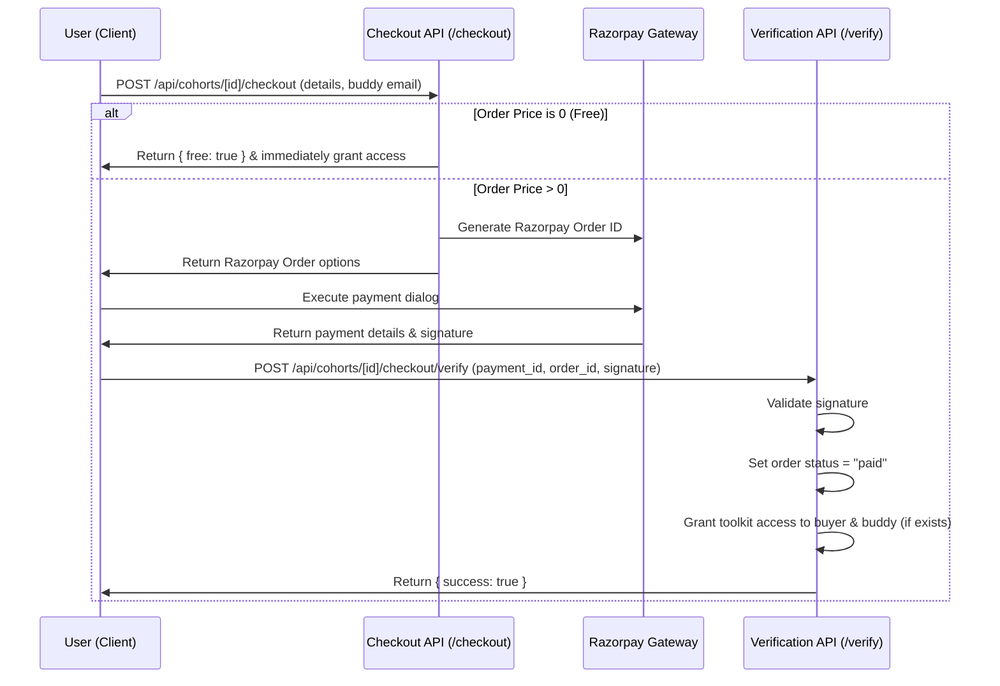

# Cohort Program Architecture & Documentation

This document explains the technical architecture, business logic, checkout flow, referral rules, and troubleshooting guidelines for the Cohort Program module.

---

## 1. Schema & Data Model

The cohort program is managed using the following database tables (defined in `lib/schema.ts`):

### `cohorts`
- Represents the cohort program itself.
- Contains title, subtitle, startDate, highlights (array), coverImageUrl, and a linked `toolkitId`.
- **Linked Toolkit**: A cohort is linked to a specific toolkit via `toolkitId`. Accessing the cohort grants the user (and their buddy) access to this toolkit's lessons.

### `cohort_sessions`
- Represents curriculum sessions shown week-by-week.
- Contains `priceDelta` column.
- **Linked Add-ons**: If `priceDelta` > 0, the session is treated as an individual purchasable add-on in the checkout apply drawer.

### `cohort_tiers`
- Bundle package options (e.g. Basic, VIP). Contains `price` (in INR).

### `cohort_orders`
- Stores all purchase history.
- **Key Columns**:
  - `status`: `"pending"` or `"paid"`.
  - `userId`: Buyer's account identifier.
  - `buddyEmail`: Optional email of a referred friend.
  - `selectedTierId`: Selected package.
  - `selectedAddOnIds`: Array of selected individual session IDs (`cohort_sessions.id`).
  - `selectedToolkitIds`: Array of extra toolkits purchased as add-ons.

---

## 2. Business & Verification Logic

### Access Rights (Authorization)
Access to the cohort page and its linked toolkit contents is granted to a user if:
1. **Primary Buyer**: They purchased it (`userId` matches logged-in user).
2. **Buddy Referral**: They were referred by a buyer (`buddyEmail` matches logged-in user's email).

This is validated dynamically across all core API endpoints:
- Cohort Page GET: `/api/cohorts/[id]`
- Toolkit Access Checks:
  - `/api/toolkits/[id]/access`
  - `/api/toolkits/[id]/content`
  - `/api/toolkits/[id]/community`
  - `/api/toolkits/[id]`

### Checkout Validation Rules
- **Enforced Selection**: A checkout order is rejected if neither a bundle tier (`selectedTierId`) nor at least one individual session (`selectedAddOnIds`) is selected. 
- **Mutually Exclusive**: A user cannot checkout both a bundle tier and individual sessions simultaneously.
- **Toolkit Addon Restrictiveness**: Toolkit addons purchased separately during checkout are granted **only** to the primary buyer. The referred buddy only gets access to the cohort and its linked toolkit.

---

## 3. Checkout & Payment Flow

---

## 4. Admin Cohort Management Tabs

Admins can manage cohorts under `Cohort Management`:
- **Details Tab**: General details (title, subtitle, cover image, highlights).
- **Mentors Tab**: Select active mentors for the program.
- **Features Tab**: Define checklist features (e.g. Resume Polish, Mock Interviews).
- **Pricing Tab**: Edit pricing tiers.
- **Curriculum Tab**: Create curriculum sessions. Entering a **Price Delta** here automatically exposes that session as a standalone checkable purchase option in the checkout drawer.
- **Orders Log Tab**: Lists all cohort orders. Displays buyer info, buddy email address (marked with "Buddy Added"), cohort tier, paid amount, and payment status.

---

## 5. Troubleshooting & Bug Resolution

### Bug: "Cohort fails to load on the Admin Page"
- **Reason**: The database schema is out of sync or missing fields like `cardImageUrl`, `startDate`, `highlights`, or `price_delta`.
- **Fix**: Run database migrations to align columns. Make sure the Drizzle schema `cohorts` and `cohortSessions` match the SQL database.

### Bug: "Buddy logs in but has no access"
- **Reason**: The buddy's email in the login provider (Better Auth) does not match the `buddyEmail` spelling stored in the `cohort_orders` table, or the email was not trimmed/lowercased correctly.
- **Fix**: Verify the spelling of the buddy email in the admin orders log. Check if the database has it in lowercase.

### Bug: "Razorpay payment completes but access is not granted"
- **Reason**: Signature validation failed, or network timeout prevented client from calling the `/verify` API.
- **Fix**: Check `cohort_orders` table. If Razorpay payment is success in dashboard, manually update order status in DB to `"paid"`.
